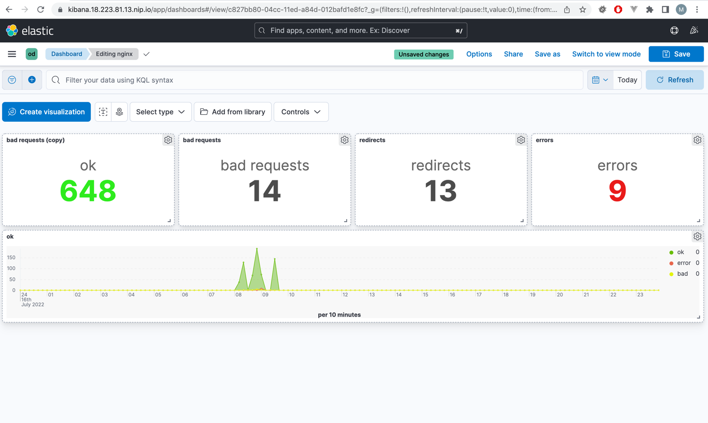

# Выполнено ДЗ № 10 logging

- [x] Основное ДЗ
- [x] Задание со *

Выполнил все задания кроме логов аудита и хостов

**TODO:**
После сдачи дипломной работы вернутся к логам [аудита](https://kubernetes.io/docs/tasks/debug/debug-cluster/audit/) и к логам хостов
+ к [логированию ивентов](https://github.com/max-rocket-internet/k8s-event-logger/tree/master/chart)

## В процессе сделано:

### Настроил логирование nginx ingress на стэке EFK

- Добавил дашбоард в Kibana

- Настроил мониторинг elasticsearch на prometheus - grafana

### Настроил логирование nginx ingress на стэке Grafana Loki

- Создание datasource loki при установке prometheus-operator

- Парсинг обработка логов с помощью promtail и Loki. Cоздание дашбардов в grafana

  
## PR checklist:
- [x] Выставлен label с темой домашнего задания