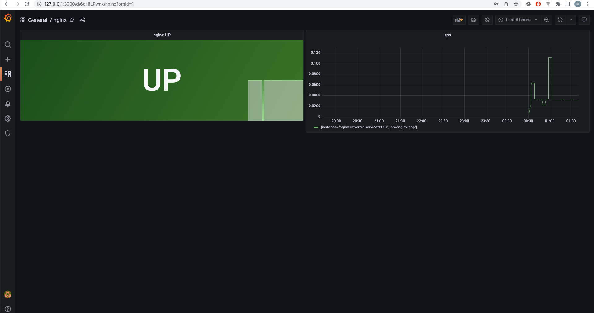

# Выполнено ДЗ № 8 Monitoring

- [x] Основное ДЗ
- [x] Задание со *

## В процессе сделано:

Поднял все руками

Деплой prometheus:
- [x] Выделил PV для prometheus server
- [x] Создал PVC для prometheus server
- [x] Создал config для prometheus
- [x] Создал сервис для prometheus
- [x] Создал statefulset c образом prometheus

Деплой nginx
- [x] Создал кастомный образ nginx, добавил эндпоинт с метриками
- [x] Создал Deloyment c этим образом
- [x] Создал сервис для nginx

Деплой nginx-exporter
- [x] Создал deployment c образом nginx-exporter
- [x] Создал service для nginx-exporter

Деплой grafana
- [x] Создал deployment c grafana
- [x] Создал сервис для grafana

## Как запустить проект:

Применить манифесты из папки kubernetes-monitoring

## Как проверить работоспособность:

1. Пробросить порты сервиса grafana-service на локальную машину
2. Открыть графану в браузере http://localhost:/3000, добавить data source prometheus на хосте http://prom-service:9090
3. Импортировать [dashboard](./manual/dashboards/grafana-nginx.json) 

## PR checklist:
- [x] Выставлен label с темой домашнего задания