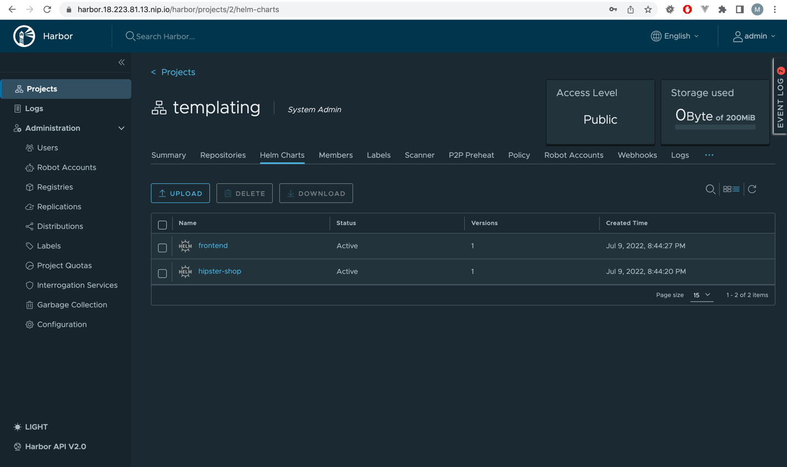
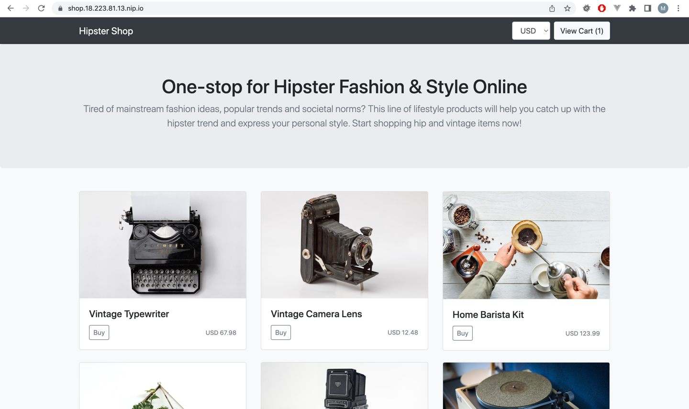
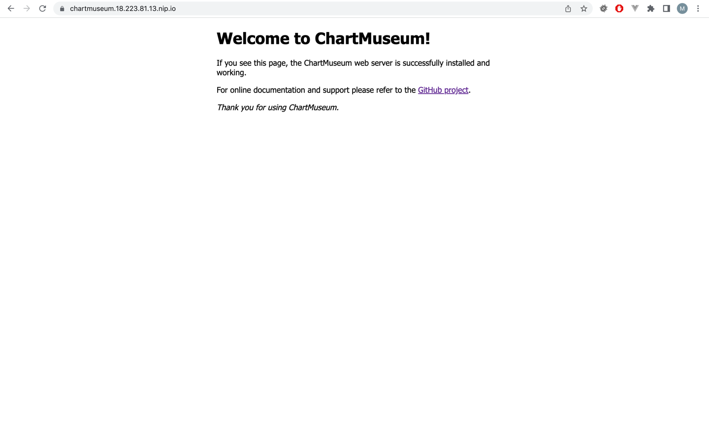

# Выполнено ДЗ № 7 Helm templating

- [x] Основное ДЗ
- [x] Задание со * 

Выполнил все задания по Helm

**TODO:**
После сдачи дипломной работы вернутся к шаблонизаторам и попробовать альтернативы:
* kubeconfig
* qbec
* Kapitan
* Kustomize

## В процессе сделано:

Задание со * - Установка чарта из chartmuseum

1. Создал helm chart

```shell
> helm create web-app
```
2. Архивация чарта
```shell
> helm pakcage web-app
```
3. Установка плагина chartmuseum push plugin
```shell
> helm plugin install https://github.com/chartmuseum/helm-push
```
4. Добавление репы chartmuseu в helm
```shell
> helm repo add chartmuseum https://chartmuseum.3.130.101.65.nip.io/
```
5. Загрузка чарта в chartmuseum
```shell
> helm cm-push web-app-0.1.0.tgz chartmuseum
```
6. Обновление репы
```shell
> helm repo update
```
7. Установка чарта из chartmuseum
```shell
> helm -n web-app install web-app chartmuseum/web-app
```

Выполнил все задания по helm

Скрин: harbor


Скрин: shop


Скрин: chartmuseum


## Как запустить проект:

```shell
> ./repo.sh
> helm repo update
> helm -n hipster-shop install hipster-shop --create-namespace templating/hipster-shop
```
requirements: ingress-nginx

## Как проверить работоспособность:

## PR checklist:
- [x] Выставлен label с темой домашнего задания